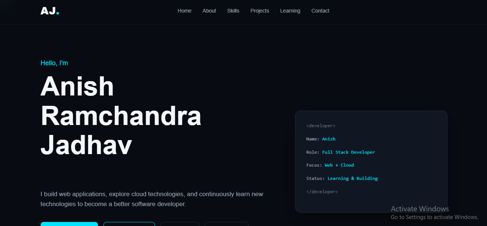

# Anish Jadhav - Developer Portfolio


A responsive personal developer portfolio website built from scratch using HTML, CSS, and JavaScript.

The website showcases my skills, learning journey, projects, career interests, resume, and contact information as an MSc IT Cloud Computing student and aspiring Full Stack Developer.

## 🌐 Live Website

[View My Portfolio](https://anis8h.github.io/anish_portfolio/)

## 👨‍💻 About Me

Hi, I'm Anish Ramchandra Jadhav.

I am currently pursuing MSc IT with a specialization in Cloud Computing. I am interested in Full Stack Development, Backend Development, Cloud Computing, and Web Technologies.

I built this portfolio website to create a professional online presence and to practice frontend web development using HTML, CSS, and JavaScript.

## 🚀 Features

- Responsive personal portfolio
- Dark developer-style UI
- Sticky navigation bar
- Mobile hamburger menu
- Smooth scrolling navigation
- Active navigation section highlighting
- Typing animation
- Scroll reveal animations
- Back-to-top button
- Skills showcase
- Projects section
- Currently learning section
- Career interests section
- Contact section
- GitHub and LinkedIn buttons
- Resume download
- Dynamic footer year

## 🛠️ Technologies Used

### Frontend
- HTML5
- CSS3
- JavaScript

### Tools
- Visual Studio Code
- Git
- GitHub
- Browser Developer Tools

## 📁 Project Structure

```text
anish-portfolio/
│
├── index.html
├── style.css
├── script.js
├── Anish_Jadhav_Resume.pdf
└── README.md 

## 🌐 Live Demo

[View Live Portfolio](https://anis8h.github.io/anish_portfolio/)

## 📸 Screenshots

### Home



### Projects


📌 Sections
Home

Introduction, developer title, short description, and quick action buttons.

About

Information about my education, interests, and development goals.

Skills

Technical skills organized into:

Frontend Development
Backend Development
Database
Programming
Tools
Cloud Computing
Projects

Currently includes this portfolio project and a placeholder for future full-stack projects.

Learning

Technologies and concepts that I am currently learning.

Career Interests

My areas of professional interest include:

Full Stack Development
Backend Development
Cloud Computing
Web Technologies
Software Development
Contact

Provides options to contact me through email and phone.

📱 Responsive Design

The website is designed to work across:

Desktop
Laptop
Tablet
Mobile devices

A mobile hamburger navigation menu is included for smaller screens.

⚙️ JavaScript Functionality

JavaScript is used for:

Navbar scroll effect
Scroll reveal animation
Active navigation links
Smooth scrolling
Mobile navigation menu
Typing animation
Dynamic footer year
Back-to-top functionality

📄 Resume

My resume is available directly from the portfolio website through the Download Resume button.

🎯 Purpose of the Project

This project was created to:

Build a professional developer portfolio.
Practice HTML, CSS, and JavaScript.
Learn Git and GitHub workflow.
Deploy a static website using GitHub Pages.
Create a project that can be presented during internship applications and interviews.

🔮 Future Improvements

Planned improvements include:

Add more full-stack projects
Add project demo links
Add GitHub project links
Improve accessibility
Add additional animations
Add a functional contact form
Add backend/API integration
Add more cloud-based projects

👨‍🎓 Education

MSc IT – Cloud Computing
2026 – Present

BSc Computer Science
CGPA:7.12

📫 Contact

Name: Anish Ramchandra Jadhav

Email: anishjadhav989@gmail.com

Location: Maharashtra, India

⭐ Acknowledgement

This portfolio was designed and developed by me as part of my journey toward becoming a Full Stack Developer.
